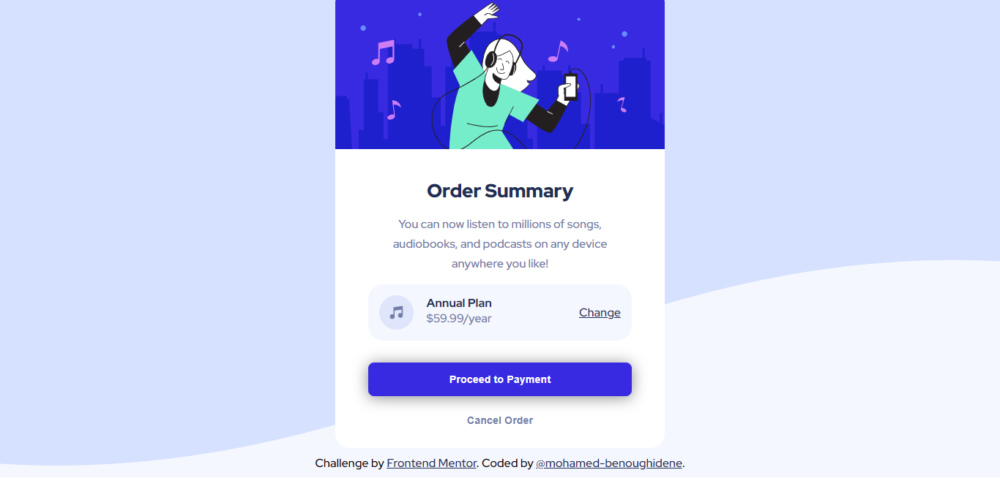

# Frontend Mentor - Order summary card solution

This is a solution to the [Order summary card challenge on Frontend Mentor](https://www.frontendmentor.io/challenges/order-summary-component-QlPmajDUj). Frontend Mentor challenges help you improve your coding skills by building realistic projects.

## Table of contents

- [The challenge](#the-challenge)
- [Screenshot](#screenshot)
- [Links](#links)
- [Author](#author)

### The challenge

Users should be able to:

- See hover states for interactive elements

### Screenshot

### Links

- Solution URL: [solution URL here](https://github.com/mohamed-benoughidene/Order-summary-component)
- Live Site URL: [Add live site URL here](https://glittering-cat-2217ad.netlify.app)

### Built with

- Semantic HTML5 markup
- CSS
- Flexbox
- Mobile-first workflow
- [React](https://reactjs.org/) - JS library

## Author

- Frontend Mentor - [@mohamed-benoughidene](https://www.frontendmentor.io/profile/mohamed-benoughidene)
